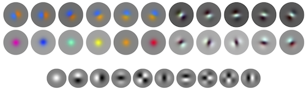
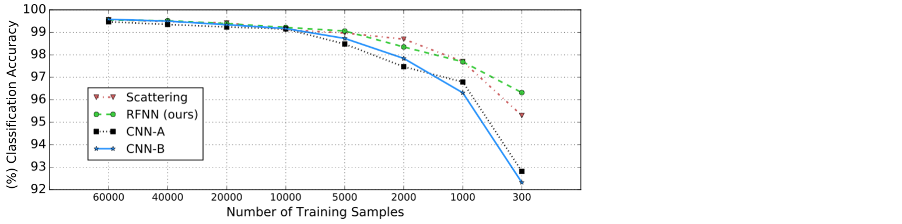

# RFNN Code 


## Structured Receptive Fields in CNNs

Structured receptive field networks (RFNNs) are CNNs whose filters are learned from a low-order symmetric basis, rather than from mere pixel values as done in vanilla CNNs. RFNNs can operate on restricted, low-order feature spaces that allow them to outperform classical CNNs by large margins when data is scarce.

Reference: [J.-H. Jacobsen](https://jhjacobsen.github.io/), [J.v. Gemert](http://jvgemert.github.io/), [Z. Lou](http://jvgemert.github.io/), [A.W.M. Smeulders](https://staff.fnwi.uva.nl/a.w.m.smeulders/); [Structured Receptive Fields in CNNs](https://arxiv.org/pdf/1605.02971v2.pdf).
*Proceedings of the Conference of Vision and Pattern Recognition (CVPR), 2016*



Some first layer filters as trained on ILSVRC2012 and the basis they are learned from. The filters are mainly rotated versions of the basis itself that learned to recombine input channels. Note that all filters in all layers of an RFNN are learned from such a Gaussian derivative basis.

## Results

We focus on the following experimental questions

- Are low-order Gaussian derivatives a sufficient basis for challenging tasks like Imagenet
- How does an RFNN compare to CNNs when training data are limited
- How does an RFNN compare on a task where Scattering Networks excel

### Accuracy ILSVRC-2012 Subsets

We evaluate our RFNN on multiple subsets of Imagenet. 

- ILSVRC 2012 1000 class standard
- ILSVRC 2012 100 biggest classes
- ILSVRC 2012 10 biggest classes

We show an RFNN outperforms plain CNNs when data and presented visual variety are limited.


| Model                       | ILSVRC2012val-10  | ILSVRC2012val-100  | ILSVRC2012val-full |
|-----------------------------|-------------------|--------------------|--------------------|
| Network in Network [6]      | 76.97             |67.30               | 56.78              |
| RFNiN                       | 83.36             |70.78               | 54.04              |
| RFNiN BN                    | 84.77             |72.30               | 55.92              |

Top-1 accuracy is reported, default Caffe pre-processing and no data augmentation was used. 
The Network in Network was used as provided in the [Caffe model zoo](https://gist.github.com/mavenlin/d802a5849de39225bcc6). 


### MNIST

We evaluate our RFNN on multiple subsets of MNIST as done in [2].

We show an RFNN can be as stable as Scattering when the number of training samples is limited while it outperforms plain CNNs by large margins.



Note that CNN-B and RFNN share the same architecture, the only difference is our RF approach on the individual filters. Hyperparameter settings to reproduce the results can be found [here](./figures/train_figure_5.txt).

## Implementations

### [Caffe RFNN](Caffe/)

Tested with: cudnn v3; cuda 7.0; + standard caffe requirements

```
cd /path/to/RFNN/caffe_rfnn
```
set Makefile.config paths
```
make all
make runtest
make test
```

Train an RFNN on 10 biggest classes of ILSVRC2012

Download data
```
cd /path/to/RFNN/data/ILSVRC2012/10class/
follow instructions in .txt file
```
Train model (before execution change "/path/to/" everywhere)
```
$ /path/to/RFNN/caffe-rfnn/build/tools/caffe train -solver=solver_RFNN_Small_ILSVRC2012_train_val_10class.prototxt
```
Full Imagenet pre-trained RFNN that achieves 55.92% top-1 accuracy corresponding to "RFNN_BN_ILSVRC2012_train_val.prototxt" model definition and "solver_RFNN_BN_ILSVRC2012_train_val.prototxt" solver file can be downloaded here:
```
$ cd /path/to/RFNN_beta/caffe-rfnn/models/rfnn
$ bash get_pretrained_models.sh
```
Our added module: Basis Convolution Layer

Options implemented for Gaussian derivative basis: gaussian_basis_1st_order; gaussian_basis_2nd_order; gaussian_basis_3rd_order; gaussian_basis_4th_order
```
layer {
  bottom: "data"
  top: "basisconv"
  name: "basisconv"
  type: "BasisConvolution"
  param {
    lr_mult: 0
    decay_mult: 0
  }
  param {
    lr_mult: 0
    decay_mult: 0
  }
  basis_convolution_param {
    num_basis: [number of basis filters, is eg 37 for 4-scale basis of order 3]
    kernel_size: [2 times largest sigma is sensible, can be chosen lower if computation time is an issue]
    stride: [subsampling]
    group: [number of input channels, so basis convolves over all input channels without sum]
    weight_filler {
      type: "gaussian_basis_3rd_order" [Initializes Gaussian derivative basis of 3rd order]
      num_basis: [number of basis filters, is eg 37 for 4-scale basis of order 3, allows to truncate basis]
      sigma: [Lowest scale in basis. Denotes standard deviation of smallest Gaussian kernel in basis, is sampled with 2^scale from there. For 37 basis filters and "gaussian_basis_3rd_order", we get 10 filters with sigma=1, 9 filters with sigma=2, 9 filters with sigma=4, 9 filters with sigma=8]
    }
    bias_filler {
      type: "constant"
      value: 0
    }
  }
}
```

### [Theano RFNN](Theano/)

Requirements: Python, Theano, Lasagne, Pylearn2, Numpy, Pylab, Scipy, cudnn v5

Download MNIST data
```
$ cd /path/to/RFNN/data/
$ bash get_data.sh
```
Train an RFNN on MNIST in Theano
```
$ python /path/to/RFNN/theano-rfnn/run_rfnn.py --epochs 100 --ntrain 60000
```
ntrain determines the number of randomly chosen samples from MNIST, to reproduce figure 5 from paper.

## Cite
If you use our code or ideas from our method, please be so kind to cite:
```bibtex
@InProceedings{Jacobsen_2016_CVPR,
author = {Jacobsen, Jorn-Henrik and van Gemert, Jan and Lou, Zhongyu and Smeulders, Arnold W. M.},
title = {Structured Receptive Fields in CNNs},
booktitle = {The IEEE Conference on Computer Vision and Pattern Recognition (CVPR)},
month = {June},
year = {2016}
}
```

#### Related Work

1. Scale and the differential structure of images, *Florack et al., 1992*
2. Invariant Scattering Convolutional Networks, *Bruna and Mallat, 2012*
3. Deep Roto-Translation Scattering for Object Classification, *Oyallon and Mallat, 2014*
4. A Mathematical Motivation for Complex-Valued Convolutional Networks, *Tygert et al., 2016*
5. Group Equivariant Convolutional Networks, *Cohen and Welling, 2016*
6. Network in Network, *Lin et al., 2014*
